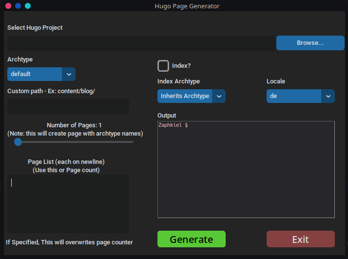

# Hugo Pages Generator GUI
Hugo Static Site page generator GUI. 

Making page in hugo is not that hard, but what if you want to make 500 pages? well it can be automated...
So, i kind of did.

This is just a program I made during learning Python GUI, Don't expect it to be perfect. it uses python CustomTkinter 
module, which is a modified version of Tkinter module. and HUGO CLI to generate pages.

### Features:
- Generate 500 Pages in Seconds.
- Custom Path option for better management.
- Major Locale Support.
- Custom file name or file count option.
- Automatic Handling of INDEX.md and _INDEX.md for leaf bundle.

### Here's UI Screenshot



### Requirements
- Python 3.6 or above
- HUGO (installed and added to PATH)
- CustomTkinter
- Tkinter
- tkterminal

### Installation (Easy and Recommended) (Tested on Linux)
- Download Latest Release from [here](https://github.com/Prakash4844/Hugo_Pages_Generator/releases/)
- Extract it
- Run `Hugo Page Generator` binary file using terminal by typing `./Hugo\ Page\ Generator`

### installation (Manual)
- Install Python 3.6 or above
- Install HUGO and add it to PATH
- Clone this repo
- Install requirements by running `pip install -r requirements.txt`
- Run `python main.py`
- Done!

### Usage
- Run `python main.py`
- Enter the path of your HUGO project
- Select the type of page you want to make(Archetype)
- Put Custom path if you want to make page in custom path
  - Ex. `Content/blog/`  
  - default is `content/`
  - No need for "" in path if custom path have spaces, as they are handled(see [#2](https://github.com/Prakash4844/Hugo_Pages_Generator/issues/2))
  - Note: If custom path doesn't have last `/` then the last word in path will be prefixed to each filename
  - custom path need to start with `content` and end with a `/`, only ignore this if you know what you are doing
- Enter the number of pages you want to make or Enter Page name in the page name textbox each on new line (Note: If page
name is entered then number of pages will be ignored)
- IF index is needed check the checkbox of it
- IF you want to Select a different Archetype for index then select it from the dropdown OR it will inherit the 
Archetype of the page
- Select the locale of the page
- Click on Generate button
- Output will be shown in the terminal
- Done!
- Bonus: You can Star this repo if you want to 😀

### Building

- Install Python 3.6 or above
- Install HUGO and add it to PATH
- Clone this repo
- Install requirements by running `pip install -r requirements.txt`
- Run 
  ```bash
  pyinstaller --noconfirm --onedir --console --icon "/hugo.ico" --name "Hugo Page Generator" --add-data "/hugo.ico:." --add-data "/locale_list:." --add-data "/README.md:." --add-data "/venv/lib/python3.11/site-packages/customtkinter:customtkinter/"  "/main.py"
  ```
- Done!

#### Note: Do not manually interact with integrated terminal.
